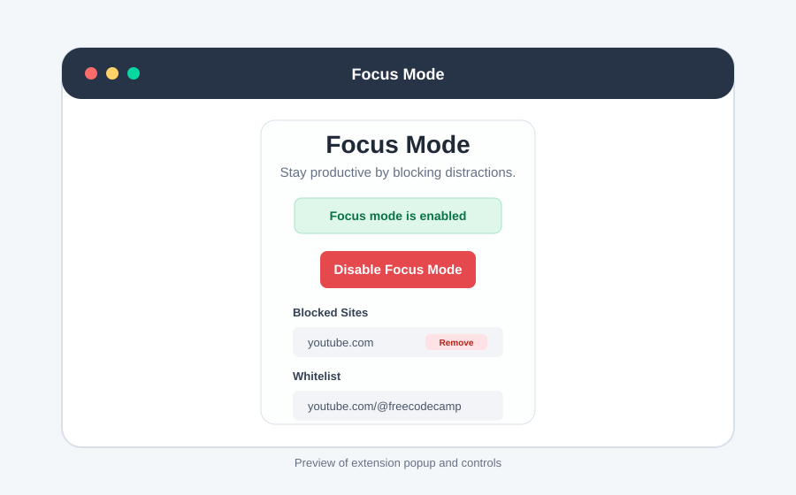

# Focus Mode Chrome Extension

A Chrome extension that helps users stay focused by blocking distracting websites while still allowing specific approved content through a whitelist.



## What It Demonstrates

- Chrome Extension Manifest V3 architecture
- Background service worker logic for monitoring tabs
- Persistent user settings with `chrome.storage.sync`
- Custom blocklists and whitelists
- YouTube-specific whitelist handling for videos, playlists, and channels

## Features

- Toggle focus mode on or off from the extension popup
- Block common distracting sites such as YouTube, Netflix, TikTok, and Prime Video
- Add or remove custom blocked domains
- Whitelist specific URLs so useful content can remain accessible
- Support YouTube video, playlist, and channel whitelisting through the YouTube Data API
- Persist settings across browser sessions with Chrome storage

## How It Works

When focus mode is enabled, the background service worker listens for tab URL changes. If the current URL matches a blocked domain, the extension checks the whitelist before closing the tab. This keeps the blocking logic flexible: broad distracting sites can be blocked while specific educational or useful content can still be allowed.

For YouTube, the extension can resolve video and channel information with the YouTube Data API so whitelist rules can be more precise than simple domain blocking.

## Tech Stack

- JavaScript
- Chrome Extension APIs
- Manifest V3
- Chrome storage
- YouTube Data API
- Bulma CSS

## Local Setup

1. Clone the repository.

2. Create a `config.js` file in the project root:

   ```js
   const CONFIG = {
     YOUTUBE_API_KEY: "YOUR_API_KEY",
   };

   export default CONFIG;
   ```

3. Open Chrome and go to:

   ```text
   chrome://extensions/
   ```

4. Enable **Developer mode**.

5. Click **Load unpacked** and select this project folder.

6. Open the extension popup and enable focus mode.

## Notes

- User settings are stored with `chrome.storage.sync`.
- The extension does not collect or sell user data.
- The YouTube API key should stay local and should not be committed.
- See [privacy-policy.md](privacy-policy.md) for the privacy policy.
